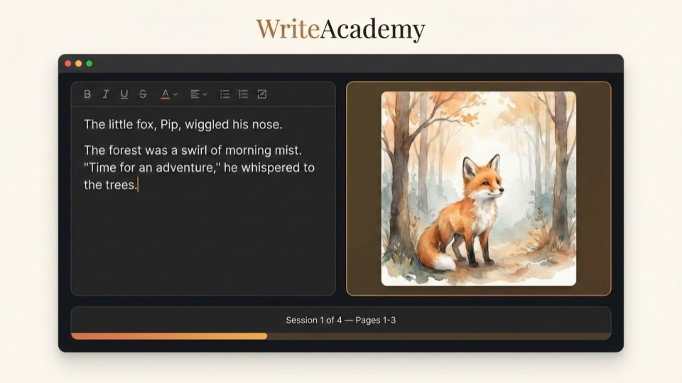
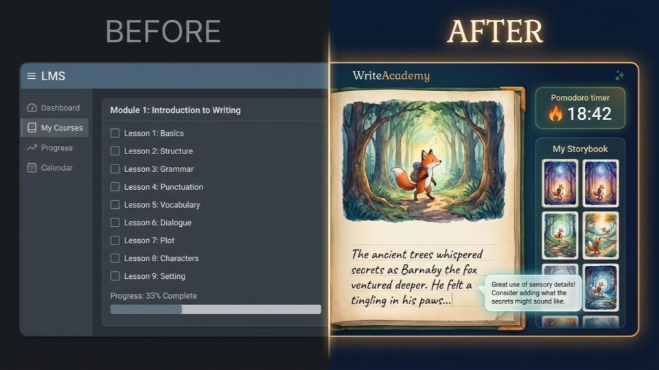
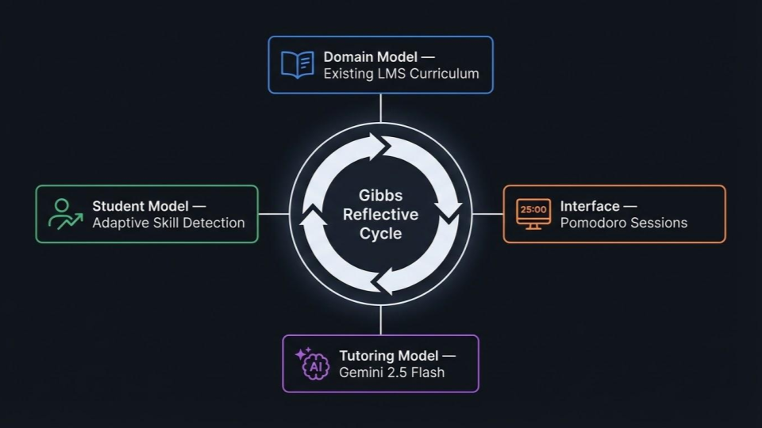
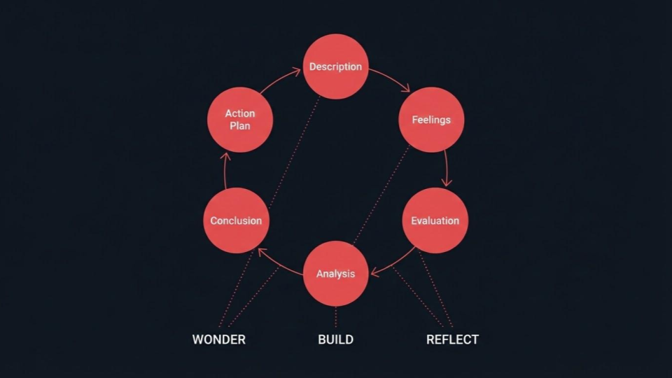
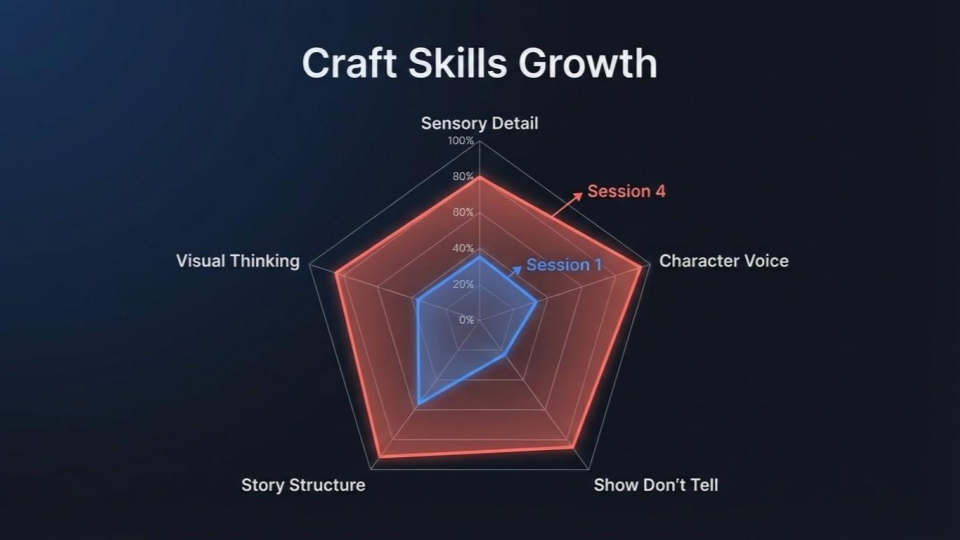
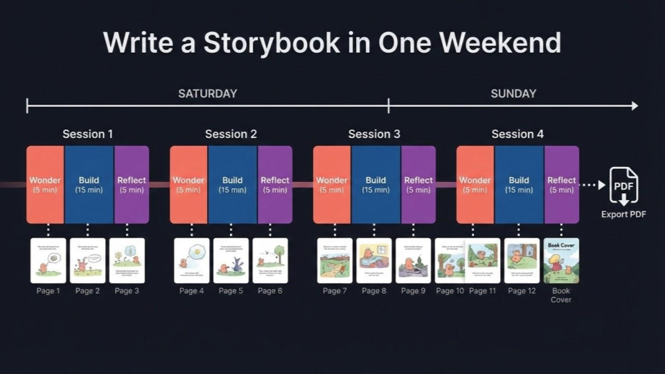
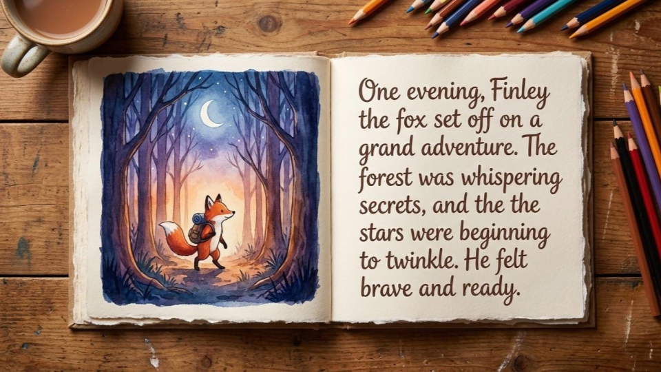

# WriteAcademy ITS — AI-Powered Creative Writing Tutor

**Hackathon submission · Google Gemini Creative Storyteller track**

WriteAcademy is an Intelligent Tutoring System that teaches creative writing through a *story-first, Pomodoro-paced* experience. Learners write and illustrate a real children's storybook across four 25-minute sessions (~2 hours total), with Gemini 2.5 Flash providing adaptive coaching, illustration generation, and structured feedback at every step.

## Live Demo

https://writeacademy-web-495938100779.us-central1.run.app/

> Click **"Skip to demo with a pre-written story"** on the landing page to instantly load a complete 12-page storybook with cached illustrations — no Gemini calls, no waiting.

---

## The Problem

Creative writing instruction is almost always declarative. "Show, don't tell" gets *defined*, never *demonstrated*. Craft books are static. One-on-one coaching is expensive and inaccessible. No existing tool lets a learner practice a technique, see it applied in their own story, and receive feedback that references their actual words — all in one session.



## The Solution

WriteAcademy flips the model: **the story is the curriculum**. Instead of lessons that assign writing exercises, learners build a 12-page illustrated children's book. Each session embeds craft techniques (sensory detail, character voice, show-don't-tell) directly into the writing task, assessed and adapted from the learner's own skill level. The finished storybook is both the learning artifact and the portfolio piece.

---

## ITS Architecture (4 Components)

WriteAcademy follows the classic ITS architecture — Domain, Student, Tutoring, and Interface models — unified by the **Gibbs Reflective Cycle** as the pedagogical framework that links them all together.



<details>
<summary>Text version of architecture diagram</summary>

```
┌─────────────────────────────────────────────────────────────────┐
│                    GIBBS REFLECTIVE CYCLE                       │
│          (Domain Model — the pedagogical backbone)              │
│                                                                 │
│   Description ─► Feelings ─► Evaluation ─► Analysis            │
│                                    │           │                │
│                              Conclusion ◄─ Action Plan          │
├─────────────────────────────────────────────────────────────────┤
│                                                                 │
│  STUDENT MODEL          TUTORING MODEL        INTERFACE MODEL   │
│  ┌──────────────┐      ┌──────────────┐      ┌──────────────┐  │
│  │ 5 craft      │      │ Gemini 2.5   │      │ 3-act session│  │
│  │ dimensions   │─────►│ Flash        │─────►│ structure    │  │
│  │ assessed at  │      │              │      │              │  │
│  │ onboarding   │      │ • Session    │      │ Discover(5m) │  │
│  │              │      │   planning   │      │ Write  (15m) │  │
│  │ Adaptive     │      │ • Craft      │      │ Review  (5m) │  │
│  │ technique    │      │   coaching   │      │              │  │
│  │ modes:       │      │ • Illustration│     │ Storybook    │  │
│  │ full/compress│      │   generation │      │ viewer with  │  │
│  │ /skip        │      │ • Gibbs      │      │ page turns   │  │
│  │              │      │   feedback   │      │              │  │
│  └──────────────┘      └──────────────┘      └──────────────┘  │
└─────────────────────────────────────────────────────────────────┘
```

</details>

### Domain Model: Gibbs Reflective Cycle



The six Gibbs phases aren't shown as explicit steps to the learner. Instead, they're embedded in the 3-act session structure:

| Session Act | Gibbs Phases | What the learner experiences |
|---|---|---|
| **Discover** (5 min) | Description + Feelings | Published book example, technique discovery |
| **Write** (15 min) | Evaluation + Analysis | Write 3 pages with real-time craft coaching |
| **Review** (5 min) | Conclusion + Action Plan | Storybook viewer, Gibbs feedback cards, next-session hook |

### Student Model: Adaptive Skill Detection



At onboarding, the learner writes a ~150-word story opening. Gemini analyses it across 5 craft dimensions:

- **Sensory Detail** — appeals to sight, sound, touch, taste, smell
- **Character Voice** — distinct personality in dialogue and narration
- **Show Don't Tell** — demonstrating emotions through action, not labels
- **Story Structure** — beginning, middle, end with rising tension
- **Visual Thinking** — writing that translates well to illustration

Each dimension is rated `developing`, `competent`, or `strong`. Techniques the learner already demonstrates are compressed or skipped; weaker areas get full instruction.

### Tutoring Model: Gemini-Powered

Every AI interaction uses Gemini 2.5 Flash:

- **Session Planning** — generates adaptive 3-act plans with story beats, technique selections, and page-specific writing prompts
- **Craft Coaching** — streams real-time feedback on drafts, referencing the learner's prior pages to surface growth
- **Illustration Generation** — creates consistent illustrations using a multi-image visual bible (main character + secondary characters + environment)
- **Gibbs Feedback** — structured end-of-session feedback across all 6 Gibbs phases, with specific quotes from the learner's writing

### Interface Model: Pomodoro Sessions



Each session is a 25-minute Pomodoro with three acts:

1. **Discover** — a published children's book example is presented; the learner discovers the technique through analysis, not lecture
2. **Write** — the learner writes 3 pages of their storybook with Gemini coaching and instant illustration reveals
3. **Review** — view the growing storybook, read Gibbs-structured feedback, preview the next session's story beat

---

## Demo Flow

### Full experience (~2 hours)

1. **Onboarding** — enter name, describe your character and world, write a story opening
2. **Session 1–4** — each session writes 3 illustrated pages of the storybook
3. **Review** — after each session, read your book with page-turn animations and review personalised Gibbs feedback
4. **Export** — download the finished illustrated storybook as a PDF

### Quick demo (~5 minutes)

1. Click **"Skip to demo"** on the landing page — seeds a complete 12-page "Pink Bears Easter Party" story
2. Click through Discover → Write (drafts are pre-filled, illustrations load from cache) → Review
3. Use the storybook viewer to page through the illustrated book
4. Click "Next Session" to advance through all 4 sessions
5. Export to PDF at any point

---

## Features



- **Adaptive curriculum** — onboarding skill assessment drives technique selection and instruction depth
- **Real-time craft coaching** — streamed NDJSON feedback referencing the learner's prior pages
- **AI illustration** — Gemini generates consistent illustrations with dual-image reference (page 1 + most recent page), character bible, and environment bible
- **Storybook viewer** — interactive page-turn viewer with cover, content spreads, and back cover
- **Page editing** — revise any completed page and optionally re-illustrate
- **Gibbs feedback** — expandable feedback cards structured across 6 reflective phases
- **PDF export** — download the illustrated storybook
- **Demo mode** — one-click demo with pre-cached story data, skips all Gemini calls

---

## Tech Stack

| Layer | Technology |
|---|---|
| Backend | FastAPI (Python 3.12) on Google Cloud Run |
| AI | Gemini 2.5 Flash — structured output, streaming, image generation |
| Frontend | Next.js 16 + Tailwind CSS v4 |
| Persistence | File-based (backend) + localStorage (frontend) |
| Deployment | `gcloud run deploy --source .` (no Docker build needed) |
| Fonts / Icons | Inter (Google Fonts), Lucide React |
| Auth | Conditional API key (`DISABLE_AUTH=true` for hackathon) |

---

## Local Setup

### Prerequisites
- Python 3.12+
- Node.js 18+
- A Gemini API key (free tier works)

### Backend

```bash
cd backend
python -m venv venv
source venv/bin/activate
pip install -r requirements.txt
cp .env.example .env  # add GEMINI_API_KEY

uvicorn main:app --reload --port 8123
# → http://localhost:8123/health
```

### Frontend

```bash
cd frontend
npm install
cp .env.local.example .env.local  # set NEXT_PUBLIC_BACKEND_URL=http://localhost:8123
npm run dev
# → http://localhost:3000
```

---

## Testing Instructions (For Judges)

### Option 1: Live Demo (Recommended)

The app is deployed and running on Google Cloud Run:

**→ [https://writeacademy-web-495938100779.us-central1.run.app/](https://writeacademy-web-495938100779.us-central1.run.app/)**

No login required. Walk through the full experience in ~10 minutes:

1. **Onboarding** — enter your name, describe a character and world, then write a short story opening (~2-3 sentences is enough). The system will assess your writing skills across 5 craft dimensions.
2. **Session 1: Discover** — read the example passage and respond to the feeling prompt. The technique will be revealed based on your skill assessment.
3. **Session 1: Write** — write 3 pages of your story. After saving each page, an AI illustration will generate (allow ~10 seconds). The Craft Coach panel offers real-time feedback on your draft.
4. **Session 1: Review** — view your illustrated pages in the storybook viewer with page-turn navigation. Read the Gibbs-structured feedback cards. Preview the next session.
5. **Export** — download your illustrated storybook as a PDF.

**What to look for:**
- The skill assessment adapts which techniques are taught (check if any were marked "compress" or "skip")
- Illustrations maintain consistent character design across pages (visual bible system)
- Craft Coach feedback references your specific writing and earlier pages
- Gibbs feedback cards are structured across 6 reflective phases with quotes from your text

### Option 2: Local Setup

See the [Local Setup](#local-setup) section above. Requires Python 3.12+, Node.js 18+, and a Gemini API key.

### Option 3: Watch the Demo Video

A full walkthrough of the experience is available in our [demo video](https://youtu.be/zDKgQ8y3bI4).

---

## GCP Deployment

```bash
# Backend — Cloud Run (source deploy, no Docker build needed)
cd backend
gcloud run deploy writeacademy-api \
  --source . \
  --region us-central1 \
  --allow-unauthenticated \
  --set-secrets="GEMINI_API_KEY=gemini-api-key:latest" \
  --set-env-vars="DISABLE_AUTH=true"

# Frontend — set NEXT_PUBLIC_BACKEND_URL to the Cloud Run URL
cd frontend
gcloud run deploy writeacademy-web \
  --source . \
  --region us-central1 \
  --allow-unauthenticated
```

---

## API Endpoints

| Method | Path | Description |
|---|---|---|
| POST | `/onboard` | Onboarding: skill assessment + story setup |
| POST | `/session/plan` | Generate adaptive session plan |
| POST | `/story/page` | Save a page draft |
| POST | `/story/page/illustrate` | Generate/regenerate illustration (returns cached if available) |
| GET | `/story/{uid}/{story_id}/page/{n}` | Get a single page with illustration |
| POST | `/story/export` | Export storybook as PDF |
| POST | `/coach/feedback` | Stream craft coaching (NDJSON) |
| POST | `/coach/session-feedback` | Gibbs-cycle session feedback |
| GET | `/demo/seed` | Seed demo data (profile, story, plans, drafts) |
| GET | `/demo/runs` | List available demo story runs |
| GET | `/health` | Health check |

---

## Early Access

WriteAcademy is in active development. Sign up to get notified when we launch:

**[Join the waitlist](https://docs.google.com/forms/d/e/1FAIpQLSdUjpJqFjJVyyxoj5vpsxpI4xR3Sc1e57bdDLHmfqZ85gh2vA/viewform?usp=publish-editor)**

---

## Team

| Name | Role |
|---|---|
| Christopher Mannion | Full-stack + AI integration |
